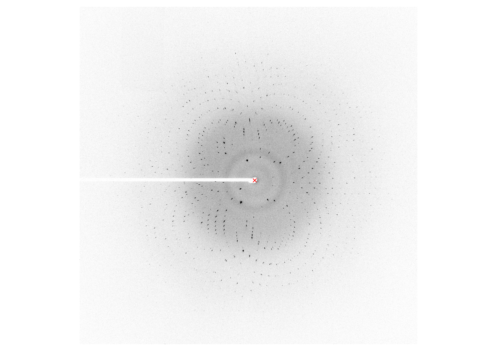

.. marccd:
   
Reading MarCCD images
=====================

Representing MarCCD-format images is very easy using ``marccd``. ::

    >>> # Read image
    >>> from marccd import MarCCD
    >>> mccd = MarCCD("tests/data/e074a_off1_011.mccd")

    >>> # Plot image and mark beam center
    >>> import matplotlib.pyplot as plt
    >>> plt.imshow(mccd.image, cmap="gray_r", vmin=10, vmax=50)
    >>> plt.plot(*mccd.center, 'rx')
    >>> plt.axis("off")

It is possible to initialize a :class:`marccd.MarCCD` object from a file or using
a ``np.ndarray`` directly. More features and methods of the  :class:`marccd.MarCCD`
class are documented below.
	   
.. currentmodule:: marccd
.. autosummary::
   :toctree: api
   :template: classtemplate.rst
	     
   ~MarCCD

